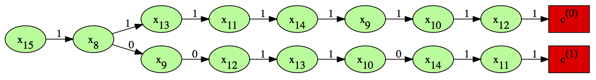
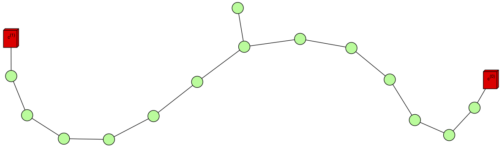

# Cache research for CS 261

## 1 Introduction

As part of a new approach
to parallelization<sup>[4]</sup>
we need a distributed cache for sparse subsets
of extraordinarily large vectors. Imagine that
you have a set of really large *n*-bit vectors, where
*n > 10<sup>9</sup>*.  A
cache entry consists of some subset of those bits
that must take on a particular value, while the
rest of the vector can take on any value. Given
a vector, we wish to find all cache entries that
match. To make this concrete, let's set
*n = 20* and assume that you
have a sequence of 20-bit vectors
and I have three cache entries:

```
Entry 1: bits 1, 3, and 5 must take on the values 101
Entry 2: bits 7,8, and 9 must take on the values 111
Entry 3: bits 1 and 19 must take on the values 01
```

Then any vector of the form `*1*0*1**************`
will match entry 1, while any vector of the form
`*******111**********`
will match entry 2, and any vector of the form: 
`*0*****************1`
will match entry 3. So, the vector `01000100000000000001`
matches both entry 1 and entry 3.
Our goal is to design an efficient cache representation
and lookup algorithm that, among other things,
takes advantage of the fact that cache entries 1 and 3
reference the same bit.

Our data sets comprise two files per kernel.
Each row of both files<sup>[5],[6],[7],[8]</sup> is a
sequence of plain text, space separated, index-value pairs
terminated by a newline character.  Each index represents
a byte offset into a state vector, so each value is thus
between 0 and 255. Taken together, the two files
represent the cache and
query data recorded while the
ASC virtual machine<sup>[4]</sup> is executing various kernels.

For example, `c.dat`<sup>[5]</sup> for the `Collatz` data set
is a cache
containing 25,643 entries that *could* achieve *superlinear*
speed-up of execution of the
`Collatz`
kernel if only we could query it fast.  Each line in `c.dat` is a
partial state vector representing the start state of a speculative
execution.
Then, `q.dat`<sup>[6]</sup> for
the `Collatz` data set is a recording of the first 1,335,172 queries that
our virtual machine made against `c.dat`. Each line in `q.dat` is a
state vector of computation that the virtual machine is sending to the
cache asking for a match.

Each line of both files has the format
*key<sub>0</sub> value<sub>0</sub> ... key<sub>d-1</sub> value<sub>d-1</sub>*,
where *d = n/8* is the number of bytes required to represent *n*
bits. For example, the first line of `c.dat` is:

```
20 248 21 255 22 255 23 191 ... 142 119 143 215 276 11 277 0 278 0 279 0 
```

This should be understood as:

> For the first cache entry, in order to match against it the
> incoming state vector must have byte 20 equal to 248, ...,
> byte 279 equal to 0.

Notice that this first entry is invariant to translations on certain
bytes, e.g. all those indices less than 20, so it doesn't even mention
them. Then, the first line of `q.dat` is:

```
0 1 1 0 2 0 3 0 ... 294 0 295 0 296 133 297 31 298 0 299 0
```

This should be understood as:

> For the first state vector, byte 0 has value 1, byte 1 has value 0,
> byte 2 has value 0, ..., byte 299 has value 0.

The goal of this project is to minimize the expected query time of `q.dat`
against some (magical) data structure over `c.dat`.

## 2 Oracle

We don't yet know which data structure is right for this problem.  The purpose
of the `oracle` described in what follows is to *separate* our
design problem into
two parts.  First, assume that the `oracle` just hands you a
data structure *a*. Second,
*evaluate* that data structure using our loss function *L(q | a, c)*. Designing
this loss function *L* is a major focus of this work,
since if we get it right, then
we can tell `oracle` to carry out a search over *a* in the design space
*A*; e.g. simulated annealing or Nelder–Mead minimization.

Our approach arises from the decision theory viewpoint<sup>[2]</sup>,
in which one
makes progress on fearsome problems by first
separating them into two parts: *utility*, and *probability*.  Often,
the problem taken as a whole is extremely difficult to reason about, but
after this separation becomes a simpler matter of selecting the
solution (or action) that according to the probability distribution
minimizes one's expected loss (or equivalently, maximizes one's expected
utility).

### 2.1 Synthetic data set

In order to focus on fine-grain details, we will work in this section
with a tiny data set
that we generate synthetically.

#### 2.1.2 Simple cache

Cache entries <em>c<sup>(i)</sup></em>
are elements of <em>{\*,0,1}<sup>k<sup></em>,
with *k &le; n*,
where <em>\*</em> is the "don't care" symbol that matches
either *0* or *1*.  We generate a simple cache as:

```
$ echo 1 255 1 248 | rs 2 2 > c.dat
```

This produces a cache *c* of size *|c| = 2*,
whose two entries are of the form
<em>c<sup>(i)</sup> = (c<sub>0</sub><sup>(i)</sup>, ..., c<sub>n-1</sub><sup>(i)</sup>)</em>. In
this example, *n = 16*, and the two entries are
<em>c<sup>(0)</sup> = (\*,\*,\*,\*,\*,\*,\*,\*,1,1,1,1,1,1,1,1)</em> and
<em>c<sup>(1)</sup> = (\*,\*,\*,\*,\*,\*,\*,\*,0,0,0,1,1,1,1,1)</em>, since
we order the bits from least significant to most significant.

#### 2.1.2 Simple query stream

Query entries <em>x<sup>(i)</sup></em>
are elements
of <em>{0,1}<sup>n<sup></em>. We generate a simple query stream as:

```
$ echo 0 255 1 255 0 0 1 0 | rs 2 4 > q.dat
```

This produces a query stream *q* of size *|q| = 2*,
whose two entries are of the form
<em>x<sup>(i)</sup> = (x<sub>0</sub><sup>(i)</sup>, ..., x<sub>n-1</sub><sup>(i)</sup>)</em>. In
this example the two entries are
<em>x<sup>(0)</sup> = (1,1,1,1,1,1,1,1,1,1,1,1,1,1,1,1)</em> and
<em>x<sup>(1)</sup> = (0,0,0,0,0,0,0,0,0,0,0,0,0,0,0,0)</em>.

### 2.2 Debugging options

We now show how to work with each step of the `oracle` machinery.

#### 2.2.1 Verify cache

The `-1` option causes `oracle` to load the cache into its internal
data structure, then dump that data structure and exit.  The following
command should produce no output:

```
$ diff -u -w <(cat c.dat) <(./oracle -1 -c c.dat)
```

#### 2.2.2 Verify cache raw code

The oracle assigns a *raw code* to each cache entry as it reads it.  Scanning
from left to right, when it encounters a bit that is *not* a don't care bit, it
extends the raw code for the current cache entry with the new bit index, using
the sign of the index to encode a specified value of *1* as *-1* and a
specified value of *0* as *+1* under the map
<em>c<sub>j</sub><sup>(i)</sup> = (-1)<sup>x<sub>j</sub><sup>(i)</sup></sup>.

The `-2` option causes `oracle` to load
the cache, assign the raw code, dump the raw code, then exit.  The reader can
verify the encoding of cache entries <em>c<sub>1</sub> and
<em>c<sub>2</sub> from above as follows:

```
$ ./oracle -2 -c c.dat
-8 -9 -10 -11 -12 -13 -14 -15 
+8 +9 +10 -11 -12 -13 -14 -15 
```

#### 2.2.3 Verify cache symbol code

The oracle assigns a *symbol code* to each cache entry by permuting each
raw code in such a way as to result in a valid binary search
tree. The `-3` option causes `oracle` to dump its symbol codes and exit:

```
$ ./oracle -3 -c c.dat
-15 -8 -13 -11 -14 -9 -10 -12 
-15 +8 +9 -12 -13 +10 -14 -11 
```

#### 2.2.4 Verify cache symbol code with dot plot

The `-4` option causes `oracle` to emit its symbol codes in the GraphViz
language appropriate for `dot`:

```
$ ./oracle -4 -c c.dat > c.dot
$ dot c.dot -T svg -o c.svg
```

The resultant plot for our example is:



#### 2.2.5 Verify cache symbol code with force directed plot

When we have many cache entries of high dimension, the `dot` layout
engine is simply
not appropriate and we need to use the `fdp` layout engine instead,
foregoing most labels.

The `-5` option causes `oracle` to emit its symbol codes in the GraphViz
language appropriate for `fdp`:

```
$ ./oracle -5 -c c.dat > c.dot
$ sfdp -Goverlap_scaling=-9 c.dot -T svg -o c.svg
```

The resultant plot for our example is:



#### 2.2.6 Verify queries

The `-6` option causes `oracle` to load the queries into its internal
data structure, then dump that data structure and exit.  The following
command should produce no output:

```
$ diff -u -w <(cat q.dat) <(./oracle -6 -q q.dat)
```

## 3 Telemetry

### 3.1 Intel cycle counting

In [arch/cycle_timing.c](arch/cycle_timing.c) is
our cycle counting logic.  Note that we
are careful to use execution barriers.

#### 3.1.1 Justification for calibration loop

We wrote [arch/cycle_timing.c](arch/cycle_timing.c) that way because the
Intel manual states that we has to "calibrate" `rdtsc` in two
ways.  First, we have to execute it enough times to settle into
a "steady state", and we have to estimate the minimum overhead imposed
by the two `cpuid` serializing instructions and the two `rdtsc`
instructions and the register copies, so we can subtract all
that off our measurements.  We imagine that you'd want to do
these two things in one calibration function that you call when
your program starts, where the calibration function returns
the minimum overhead.

See the following figure for what this looks like on one of our
server class machines for which the "steady state overhead"
is about 290 cycles.


## 4 Alternatives

### 4.1 Optimal Probability-Weighted Binary Search Trees

I spent quite a bit of time going through the decision tree literature,
but couldn't seem to find a reference that fits our problem closely
enough.  Most
uses of decision trees are in machine learning, where they are used for
prediction. We want to make use of the same statistics that the machine
learning people use to fit a decision tree, but our loss function is not
prediction error, it is rather expected search time.  

However, I think I finally stumbled upon something that may be very
promising, called the 
(probability-weighted) Optimal Binary Search Tree (OBST)<sup>[1]</sup>.

I knew about OBSTs from undergraduate algorithms courses, but I dismissed
them for our project because I have never before seen the version of them
given by Chen<sup>[1]</sup>, in which the dynamic programming solution
exploits *both* the cache contents *and* the query distribution.

The two big challenges we would face in exploiting this idea are defining
an order relation on keys and fitting a distribution to the sequence of
queries.

### 4.2 Symmetrizers

Obviously we want to match state vectors instead of molecules, but the
work by Piponi<sup>[3]</sup> is key because it puts our problem in the
nice framework of group theory: a symmetry of a cache entry is an
operation to its start state that leaves it invariant. In our
case of reads before writes, the symmetries are *any* operation
to the "don't care" bits. 

## References

[1]  Optimal Binary Search Trees 
[1]: http://alg12.wikischolars.columbia.edu/file/view/OPTIMALBST.pdf

[2]  Information Theory, Inference, and Learning Algorithms
[2]: http://www.inference.phy.cam.ac.uk/itprnn/book.pdf

[3]  Hashing Molecules
[3]: http://blog.sigfpe.com/2009/06/hashing-molecules.html

[4]  ASC: Automatically Scalable Computation
[4]: http://people.seas.harvard.edu/~apw/papers/asplos2014_r-paper289.pdf

[5]  COLLATZ cache data set
[5]: http://silicoinformatics.seas.harvard.edu/kernels/004.collatz/tiny/collatz.901.c.dat.gz

[6]  COLLATZ query data set
[6]: http://silicoinformatics.seas.harvard.edu/kernels/004.collatz/tiny/collatz.901.q.dat.gz

[7]  ISING cache data set
[7]: http://silicoinformatics.seas.harvard.edu/kernels/007.ising/medium/c.dat.gz

[8]  ISING query data set
[8]: http://silicoinformatics.seas.harvard.edu/kernels/007.ising/medium/q.dat.gz
